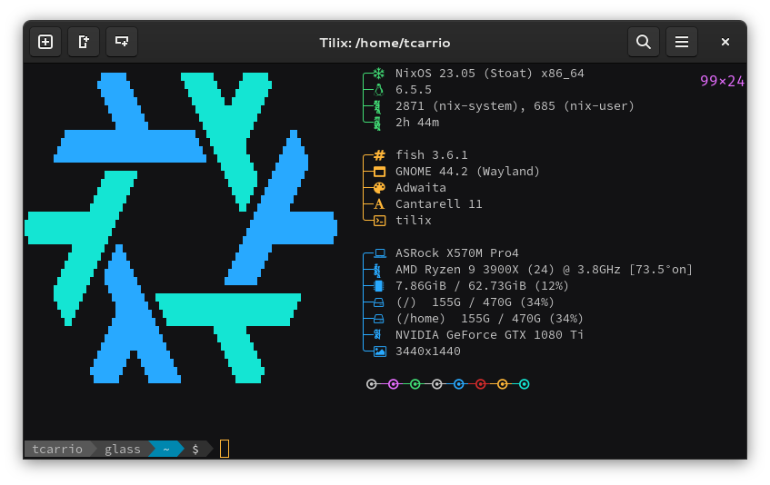
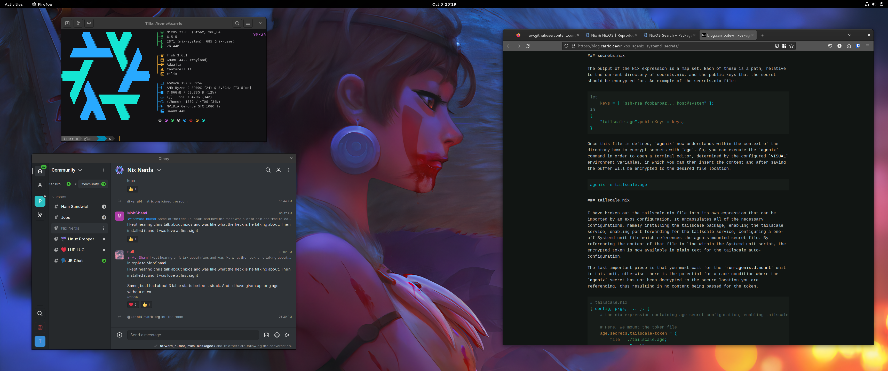

# Tom's [Nix] Configurations

[NixOS]: https://nixos.org/
[Home Manager]: https://github.com/nix-community/home-manager

This repository contains a [Nix Flake](https://nixos.wiki/wiki/Flakes) for configuring my computers and home environment. These are the computers this configuration currently manages:

|    Hostname    |       OEM      |        Model        |       OS      |     Role     |  Status  |
| :------------: | :------------: | :-----------------: | :-----------: | :----------: | :------- |
| `alien`        | Alienware      | A100 Steam Machine  | NixOS         | Desktop      | TBD      |
| `obsidian`     | DIY            | AMD Ryzen 9 3900X   | NixOS         | Desktop      | Live     |
| `sktc0`        | Apple          | Apple M1 Pro        | macOS         | Laptop       | Live     |
| `t510`         | Lenovo         | Thinkpad T510       | NixOS         | Laptop       | Live     |
| `nuc0`         | Intel          | Pentium N3700       | NixOS         | Server       | TBD      |
| `nuc1`         | Intel          | Pentium N3700       | NixOS         | Server       | TBD      |
| `nuc2`         | Intel          | Pentium N3700       | NixOS         | Server       | TBD      |
| `nuc3`         | Intel          | Pentium N3700       | NixOS         | Server       | TBD      |
| `nuc4`         | Intel          | Pentium N3700       | NixOS         | Server       | Live      |
| `nuc5`         | Intel          | Pentium N3700       | NixOS         | Server       | Live      |
| `nuc6`         | Intel          | Pentium N3700       | NixOS         | Server       | Live     |
| `nuc7`         | Intel          | Pentium N3700       | NixOS         | Server       | TBD      |
| `nuc8`         | Intel          | Pentium N3700       | NixOS         | Server       | TBD      |
| `nuc9`         | Intel          | Pentium N3700       | NixOS         | Server       | Live      |
| `rpi2`         | Raspberry Pi   | Raspberry Pi 2      | NixOS         | Server       | WIP      |

**The Graveyard**: Decommissioned machines, configurations may be outdated or missing.

|    Hostname    |       OEM      |        Model        |       OS      |     Role     |  Status  |
| :------------: | :------------: | :-----------------: | :-----------: | :----------: | :------- |
| `glass`        | DIY            | AMD Ryzen 9 3900X   | NixOS         | Desktop      | RIP 🪦   |
| `kuroi`        | Dell           | Dell Latitute E5470 | NixOS         | Laptop       | RIP 🪦   |
| `shiroi`       | DIY            | Celeron G1610T      | NixOS         | Server       | RIP 🪦   |
| `tegra0`       | Nvidia         | Tegra K1            | NixOS         | Server       | RIP 🪦   |
| `tegra1`       | Nvidia         | Tegra K1            | NixOS         | Server       | RIP 🪦   |
| `tegra2`       | Nvidia         | Tegra K1            | NixOS         | Server       | RIP 🪦   |
| `tegra3`       | Nvidia         | Tegra K1            | NixOS         | Server       | RIP 🪦   |
| `tegra4`       | Nvidia         | Tegra K1            | NixOS         | Server       | RIP 🪦   |

## Respects

This project was forked from Wimpy's nixcfg repository, which you can find [here](https://github.com/wimpysworld/nix-config). There is plenty of documentation to update so you will see plenty that is out of date here.

## Structure

- [.github]: GitHub CI/CD workflows Nix ❄️ supercharged ⚡️ by [**Determinate Systems**](https://determinate.systems)
  - [Nix Installer Action](https://github.com/marketplace/actions/the-determinate-nix-installer)
  - [Magic Nix Cache Action](https://github.com/marketplace/actions/magic-nix-cache)
  - [Flake Checker Action](https://github.com/marketplace/actions/nix-flake-checker)
  - [Update Flake Lock Action](https://github.com/marketplace/actions/update-flake-lock)
- [home-manager]: Home Manager configurations
  - Sane defaults for shell and desktop
- [nixos]: NixOS configurations
  - Includes discrete hardware configurations which leverage the [NixOS Hardware modules](https://github.com/NixOS/nixos-hardware) via [flake.nix].
- [scripts]: Helper scripts
- [shells]: [Nix shell environments using direnv](https://determinate.systems/posts/nix-direnv) for infrequently used tools

The [nixos/mixins] and [home-manager/mixins] are a collection of composited configurations based on the arguments defined in [flake.nix].

[.github]: ./github/workflows
[home-manager]: ./home-manager
[nixos]: ./nixos
[nixos/mixins]: ./nixos/mixins
[home-manager/mixins]: ./home-manager/mixins
[flake.nix]: ./flake.nix
[scripts]: ./scripts
[shells]: ./shells

## Installing 💾

- Boot off a .iso image created by this flake using `rebuild-iso-desktop` or `rebuild-iso-console` (*see below*)
- Put the .iso image on a USB drive
- Boot the target computer from the USB drive
- Two installation options are available:
    1. Use the graphical Calamares installer to install an adhoc system
    2. Run `install-system <hostname> <username>` from a terminal
       - The install script uses [Disko] to automatically partition and format the disks, then uses my flake via `nixos-install` to complete a full-system installation
       - This flake is copied to the target user's home directory as `~/0xc/nixcfg`
- Make a cuppa 🫖
- Reboot
- Login and run `rebuild-home` (*see below*) from a terminal to complete the Home Manager configuration.

If the target system is booted from something other than the .iso image created by this flake, you can still install the system using the following:

```bash
curl -sL https://raw.githubusercontent.com/tcarrio/nixcfg/main/scripts/install.sh | bash -s <hostname> <username> <type>
```

### Installing Raspberry Pi 2 (WIP)

TBD.

For now, build the image with:

```bash
nix-build '<nixpkgs/nixos>' -A config.system.build.sdImage -I nixos-config=./sdcard/rpi2.nix
# outputs to ${REPO_DIR}/result
zstdcat ./result/sd-image/nixos-sd-image-*-aarch64-linux.img.zst | dd bs=1M iflag=fullblock of=/dev/sde status=progress
```

### Installing macOS

The [nix-darwin] project provides support for managing macOS systems with Nix in a similar fashion to NixOS. With this, we can ensure that the system has everything we need available and that we can reproduce a working development environment with minimal overhead.

For the most part, the `scripts/bootstrap-darwin-machine.sh` Bash script provides sufficient automation to get a macOS machine fully configured from scratch. This includes installation of Nix through the nixos.org installer then utilizes the latest `main` ref and Nix dev shells to execute the commands. This infers the targets based on your hostname and username per the `darwin-rebuild` and `home-manager` standard, such that `darwin-rebuild` uses the `$hostname` for your default target, and `home-manager` uses `$username@$hostname`. An example of this is `tcarrio@glass`. On my `glass` workstation with the current user `tcarrio`, no additional arguments would need to be passed.

Note: Because of this, the script does not support additional arguments yet.

### Remote Installation Tips

You can often speed things up on smaller systems by delegating the build to another. For example, you might have a NixOS configuration that you could build on e.g. a 32-core AMD that you then deploy or copy resources from to an older dual-core machine. Compiling Rust programs on 3rd-gen Intels? No way!

You can do the following with a few different Nix commands:

```shell
remoteUser="foo"
remoteHost="bar"
hostname="baz"

# suppose we have a nixos system config defined in our flake
nix build .#nixosConfigurations.$hostname.config.system.build.toplevel

# we can get a reference to its path in the Nix store with
drvPath="$(nix eval ".#nixosConfigurations.$hostname.config.system.build.toplevel" --json | jq -r .)"

# now we built it locally, we could copy it to a remote system
nix-copy-closure --to $remoteUser@$remoteHost "$drvPath"

## OR, if you have a live system, nixos-rebuild encapsulates this logic and more
nixos-rebuild switch --flake .#$hostname --target-host $remoteUser@$remoteHost
```

## Applying Changes ✨

I clone this repo to `~/0xc/nixcfg`. NixOS and Home Manager changes are applied separately because I have some non-NixOS hosts.

```bash
git clone git@github:tcarrio/nixcfg ~/0xc/nixcfg
```

### NixOS ❄️

A `rebuild-host` alias is provided that does the following:

```bash
sudo nixos-rebuild switch --flake $HOME/0xc/nixcfg
```

### Home Manager 🏠️

A `rebuild-home` alias is provided that does the following:

```bash
home-manager switch -b backup --flake $HOME/0xc/nixcfg
```

### ISO 📀

Aliases for `rebuild-iso-desktop` (*desktop*) and `rebuild-iso-console` (*console only*) are provided that create .iso images from this flake. They do the following:

```bash
pushd $HOME/0xc/nixcfg
nix build .#nixosConfigurations.iso.config.system.build.isoImage
popd
```

A live image will be left in `~/$HOME/0xc/nixcfg/result/iso/`. These .iso images are also periodically built and published via [GitHub Actions](./.github/workflows) and available in [this project's Releases](https://github.com/tcarrio/nixcfg/releases).

## What's in the box? 🎁

Nix is configured with [flake support](https://zero-to-nix.com/concepts/flakes) and the [unified CLI](https://zero-to-nix.com/concepts/nix#unified-cli) enabled.

### Structure

Here is the directory structure I'm using.

```
.
├── darwin
│  ├── mixins -> ../nixos/mixins/
│  ├── default.nix
│  └── sktc0
├── home-manager
│  ├── mixins
│  │  ├── console
│  │  ├── desktop
│  │  ├── services
│  │  └── users
│  └── default.nix
├── lib
│  ├── default.nix
│  ├── helpers.nix
│  └── ssh-matrix.nix
├── LICENSE
├── nixos
│  ├── mixins
│  │  ├── av
│  │  ├── console
│  │  ├── desktop
│  │  ├── hardware
│  │  ├── services
│  │  ├── users
│  │  └── virt
│  ├── default.nix
│  ├── iso
│  │  ├── iso-console
│  │  ├── iso-desktop
│  │  └── iso-nuc
│  ├── server
│  │  ├── NUC.md
│  │  ├── nuc0
│  │  └── pxe-server
│  └── workstation
│     ├── glass
│     ├── kuroi
│     ├── t510
│     └── vm
├── overlays
├── pkgs
├── scripts
├── sdcard
├── secrets
└── shells
```

### The Shell 🐚

[Fish shell] with [powerline-go](https://github.com/justjanne/powerline-go) and a collection of tools that deliver a somewhat *"[Modern Unix]"* experience. The base system has a firewall enabled and also includes [OpenSSH], [ZeroTier], [Podman & Distrobox] and, of course, a delightfully configured [micro]. (*Fight me!* 🥊)

[Fish shell]: ./nixos/default.nix
[Modern Unix]: ./home-manager/mixins/console/default.nix
[OpenSSH]: ./nixos/mixins/services/openssh.nix
[ZeroTier]: ./nixos/mixins/services/zerotier.nix
[Podman & Distrobox]: ./nixos/mixins/virt/podman.nix
[micro]: [https://micro-editor.github.io/]



### The Desktop 🖥️

MATE Desktop 🧉 and Pantheon 🏛️ are the two desktop options available. The [font configuration] is common with both desktops using [Work Sans](https://fonts.google.com/specimen/Work+Sans) and [Fira Code](https://fonts.google.com/specimen/Fira+Code). The usual creature comforts you'd expect to find in a Linux Desktop are integrated such as [Pipewire], Bluetooth, [Avahi], [CUPS], [SANE] and [NetworkManager].

[font configuration]: ./nixos/mixins/desktop/default.nix
[Pipewire]: ./nixos/mixins/services/pipewire.nix
[Avahi]: ./nixos/mixins/services/avahi.nix
[CUPS]: ./nixos/mixins/services/cups.nix
[SANE]: ./nixos/mixins/services/sane.nix
[NetworkManager]: ./nixos/mixins/services/networkmanager.nix

|  Desktop  |       System       |       Configuration       |             Theme            |
| :-------: | :----------------: | :-----------------------: | :--------------------------: |
| MATE      | [MATE Install]     | [MATE Configuration]      | Yaru Magenta (Dark)          |
| Pantheon  | [Pantheon Install] | [Pantheon Configuration]  | elementary Bubble Gum (Dark) |

[MATE Install]: ./nixos/mixins/desktop/mate.nix
[Pantheon Install]: ./nixos/mixins/desktop/pantheon.nix
[MATE Configuration]: ./home-manager/mixins/desktop/mate.nix
[Pantheon Configuration]: ./home-manager/mixins/desktop/pantheon.nix

## Eye Candy 👀🍬



## TODO 🗒️

### Hardware

- [x] Add all computers to the table
- [x] Implement [Disko](https://github.com/nix-community/disko) partitioning
- [x] Integrate [.iso building](https://www.reddit.com/r/NixOS/comments/y1xo2u/comment/irzwe95/)
- [x] Integrate OpenRGB
- [x] Integrate OpenRazer
- [x] Integrate StreamDeck
- [x] Integrate Xone
- [ ] ~~Migrate (*maybe*) to ZFS, with backups via [`zrepl`](https://zrepl.github.io/)~~
- [x] Fix Magewell mwprocapture driver: [nixpkgs#221209](https://github.com/NixOS/nixpkgs/pull/221209)
  - [ ] [And again](https://github.com/NixOS/nixpkgs/pull/247897)
- [x] Support Raspberry Pi installer
  - [ ] With Nix flakes
- [x] Support macOS with [nix-darwin]
- [x] Support Roccat tools with group-based access control for hidraw

### Applications

- [x] Integrate an Emoji picker
- [x] Integrate AppCenter and Flathub
- [x] Integrate Steam
- [ ] Add Ferdium, Rambox or Wavebox
- [ ] Add Password Managers
    - [ ] Add Bitwarden
    - [ ] Add 1Password

### Services

- [ ] Integrate Borg Backups
  - [x] [Vorta](https://vorta.borgbase.com/) for workstations
  - [ ] [borgmatic](https://torsion.org/borgmatic/) for servers
- [ ] ~~Integrate cockpit (*server*)~~
- [ ] Integrate [notify](https://github.com/projectdiscovery/notify)
- [ ] Integrate Plex
- [ ] Integrate homepage
- [x] Integrate fwupd
- [x] Integrate Keybase
- [x] Integrate Syncthing
- [x] Integrate sshguard

### Configuration

- [x] Embed [install script in the ISO](./nixos/mixins/users/nixos/console.nix)
- [x] Integrate [agenix](https://github.com/ryantm/agenix) ~~or [sops-nix](https://github.com/Mic92/sops-nix)~~
- [x] Integrate capabilities from [nix-starter-configs](https://github.com/Misterio77/nix-starter-configs)
- [x] Integrate wallpapers
- [x] Integrate faces
- [x] Include Serif fonts
- [x] Include fallback fonts for Work Sans, Fira Code and Joypixels
- [x] Create common user settings and discrete user settings
- [x] Move application defaults out of the desktop defaults
- [x] Create standard directories in `/home/tcarrio` using `systemd.user.tmpfiles.rules`.
- [x] Create `.envrc` files in `/home/tcarrio`.
- [ ] Bind Syncthing GUI to ZeroTier.
- [ ] Configure Plank.
- [x] Fix [Unfree in Home Manager](https://github.com/Misterio77/nix-starter-configs/blob/main/minimal/home-manager/home.nix#L31))

### Game Development

- [ ] Defold
- [ ] Godot
- [ ] PICO-8

### Shell

- [ ] emacs
- [ ] fzf
- [x] tmate or tmux
- [x] micro
- [x] neovim
- [x] nnn ~~or broot or felix or ranger~~

## Inspirations 🧑‍🏫

Before preparing my NixOS and Home Manager configurations I took a look at what other Nix users are doing. My colleagues shared their configs and tips which included [nome from Luc Perkins], [nixos-config from Cole Helbling], [flake from Ana Hoverbear] and her [Declarative GNOME configuration with NixOS] blog post. A couple of friends also shared their configurations and here's [Jon Seager's nixos-config] and [Aaron Honeycutt's nix-configs].

While learning Nix I watched some talks/interviews with [Matthew Croughan](https://github.com/MatthewCroughan) and [Will Taylor's Nix tutorials on Youtube](https://www.youtube.com/playlist?list=PL-saUBvIJzOkjAw_vOac75v-x6EzNzZq-). [Will Taylor's dotfiles] are worth a look, as are his videos, and [Matthew Croughan's nixcfg] is also a useful reference. **After I created my initial flake I found [nix-starter-configs](https://github.com/Misterio77/nix-starter-configs) by [Gabriel Fontes](https://m7.rs) which is an excellent starting point**. I'll be incorporating many of the techniques it demonstrates in my nixcfg.

I like the directory hierarchy in [Jon Seager's nixos-config] and the mixin pattern used in [Matthew Croughan's nixcfg], so my initial Nix configuration is heavily influenced by both of those. Ana's excellent [Declarative GNOME configuration with NixOS] blog post was essential to get a personalised desktop. That said, there's plenty to learn from browsing other people's Nix configurations, not least for discovering cool software. I recommend a search of [GitHub nixos configuration] from time to time to see what interesting techniques you pick up and new tools you might discover.

The [Disko] implementation and automated installation is chasing the ideas outlined in these blog posts:
  - [Setting up my new laptop: nix style](https://bmcgee.ie/posts/2022/12/setting-up-my-new-laptop-nix-style/)
  - [Setting up my machines: nix style](https://aldoborrero.com/posts/2023/01/15/setting-up-my-machines-nix-style/)


<!-- References -->

[nome from Luc Perkins]: https://github.com/the-nix-way/nome
[nixos-config from Cole Helbling]: https://github.com/cole-h/nixos-config
[flake from Ana Hoverbear]: https://github.com/Hoverbear-Consulting/flake
[Declarative GNOME configuration with NixOS]: https://hoverbear.org/blog/declarative-gnome-configuration-in-nixos/
[Jon Seager's nixos-config]: https://github.com/jnsgruk/nixos-config
[Aaron Honeycutt's nix-configs]: https://gitlab.com/ahoneybun/nix-configs
[Matthew Croughan's nixcfg]: https://github.com/MatthewCroughan/nixcfg
[Will Taylor's dotfiles]: https://github.com/wiltaylor/dotfiles
[GitHub nixos configuration]: https://github.com/search?q=nixos+configuration
[Disko]: https://github.com/nix-community/disko
[nix-darwin]: http://daiderd.com/nix-darwin/
